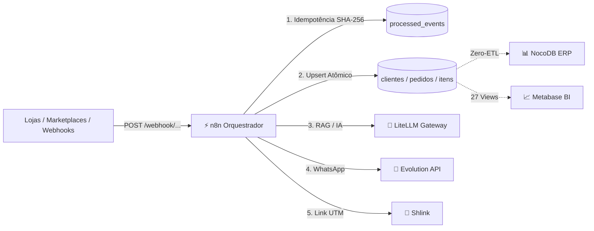

# Manual Técnico de Templates, Workflows & Automações — n8n (daemind.)

Este documento é o **guia técnico e operacional definitivo** dos **32 Templates Oficiais de Automação** do **daemind.** no **n8n**. Ele detalha os contratos de entrada (Webhooks/Crons), as variáveis de ambiente necessárias, a manipulação de dados por nó e o mapeamento exato de **onde os dados entram e saem no banco relacional (`loja_db`)**, views analíticas e painéis do **NocoDB ERP** e **Metabase BI**.

---

## 📌 Sumário

1. [Arquitetura Geral & Motor Plug & Play (`sync_n8n_templates.sh`)](#1-arquitetura-geral--motor-plug--play-sync_n8n_templatessh)
2. [Padrão SRE de Idempotência & Persistência Relacional](#2-padrão-sre-de-idempotência--persistência-relacional)
3. [Matriz de Variáveis de Ambiente & Chaves de API](#3-matriz-de-variáveis-de-ambiente--chaves-de-api)
4. [Catálogo Detalhado dos 32 Templates](#4-catálogo-detalhado-dos-32-templates)
   - [4.1 SRE & Resiliência de IA (00)](#41-sre--resiliência-de-ia-00)
   - [4.2 Growth, Vendas & Recuperação Ativa (01 a 09)](#42-growth-vendas--recuperação-ativa-01-a-09)
   - [4.3 Conversational AI, SDR & Chatbots RAG (04, 10, 11, 14, 16)](#43-conversational-ai-sdr--chatbots-rag-04-10-11-14-16)
   - [4.4 Operações, Auditoria & SRE (03, 06, 12, 13)](#44-operações-auditoria--sre-03-06-12-13)
   - [4.5 Marketing 360° & Social Media (05, 15)](#45-marketing-360--social-media-05-15)
   - [4.6 E-Commerce & Lojas Virtuais (17 a 22)](#46-e-commerce--lojas-virtuais-17-a-22)
   - [4.7 Marketplaces & Hubs Integradores (23 a 26)](#47-marketplaces--hubs-integradores-23-a-26)
   - [4.8 ERPs, Logística, Gateways & Delivery (27 a 30)](#48-erps-logística-gateways--delivery-27-a-30)
   - [4.9 Roteador Universal Fallback (31)](#49-roteador-universal-fallback-31)
5. [Guia de Observabilidade: Onde consultar no NocoDB e Metabase](#5-guia-de-observabilidade-onde-consultar-no-nocodb-e-metabase)

---

## 1. Arquitetura Geral & Motor Plug & Play (`sync_n8n_templates.sh`)

O orquestrador **n8n** atua como o **Sistema Nervoso Central** do **daemind.**, conectando webhooks de entrada (*Inbound*), processadores de Inteligência Artificial (*LiteLLM*), encurtamento rastreável (*Shlink*), mensageria WhatsApp (*Evolution API / Chatwoot*) e persistência atômica no **PostgreSQL 17 (`loja_db`)**.



### ⚡ Motor Declarativo de Sincronização
Durante a instalação ou execução do script `core/scripts/sync_n8n_templates.sh`:
- O script varre a pasta `core/templates/n8n/`.
- Valida se as dependências internas (`USE_EVOLUTION`, `USE_CHATWOOT`, `USE_SHLINK`, `USE_LISTMONK`) ou as **Chaves de API das Plataformas** (`LOJA_INTEGRADA_API_KEY`, `MERCADOLIVRE_ACCESS_TOKEN`, `BLING_API_KEY`, etc.) estão presentes no `.env`.
- Se a credencial/flag estiver ativa, o workflow é importado e ativado como `active: true` no n8n. Se não estiver configurada, o template é ignorado (`[SKIP N8N]`) sem poluir o painel do operador.

---

## 2. Padrão SRE de Idempotência & Persistência Relacional

Para garantir tolerância a falhas de rede e múltiplos reenvios de webhooks de plataformas externas, 100% dos templates seguem o padrão **Idempotência por Hashing SHA-256**:

1. **Geração do Hash:** O nó JavaScript (*Code Node*) gera um hash unívoco:
   $$\text{dedup\_hash} = \text{SHA-256}(\text{origem} + \text{numero\_pedido} + \text{status} + \text{valor})$$
2. **Verificação no PostgreSQL (`processed_events`):**
   ```sql
   INSERT INTO processed_events (source_system, event_id, webhook_topic)
   VALUES ('Mercado Livre', '{{$json.dedup_hash}}', 'pedido_Pago')
   ON CONFLICT (source_system, event_id) DO NOTHING
   RETURNING event_id;
   ```
3. **Persistência em `clientes` e `pedidos`:**
   - Realiza `INSERT ... ON CONFLICT (email/whatsapp) DO UPDATE` para unificar a identidade do cliente e somar o LTV.
   - Registra cada item em `pedidos_itens` com SKU, quantidade e CMV.
4. **Fila Outbox Transacional (`fila_mensageria`):**
   - Registra o log do disparo para auditoria com `status = 'concluido'`.

---

## 3. Matriz de Variáveis de Ambiente & Chaves de API

Para ativar qualquer um dos módulos especialistas, basta definir a variável correspondente no arquivo `.env` da raiz:

| Plataforma / Módulo | Variável no `.env` | Template Vinculado | Efeito no n8n |
| :--- | :--- | :---: | :--- |
| **Loja Integrada** | `LOJA_INTEGRADA_API_KEY` ou `USE_LOJAINTEGRADA="s"` | `17` | Ativa Ingestão de Pedidos, Itens SKU e Insumos |
| **Shopify** | `SHOPIFY_ACCESS_TOKEN` ou `USE_SHOPIFY="s"` | `18` | Ativa Ingestão Shopify, Customer Tags & Fulfillments |
| **Nuvemshop** | `NUVEMSHOP_ACCESS_TOKEN` ou `USE_NUVEMSHOP="s"` | `19` | Ativa Ingestão Nuvemshop & Meios de Pagamento |
| **WooCommerce** | `WOOCOMMERCE_CONSUMER_KEY` ou `USE_WOOCOMMERCE="s"` | `20` | Ativa Ingestão WooCommerce & Custom Fields (CPF) |
| **VTEX** | `VTEX_APP_KEY` ou `USE_VTEX="s"` | `21` | Ativa Ingestão VTEX OMS, Sellers e Faturamento |
| **Tray / Yampi / CartPanda** | `CHECKOUT_API_KEY` ou `USE_CHECKOUT="s"` | `22` | Ativa Ingestão de Checkouts Transparentes |
| **Mercado Livre** | `MERCADOLIVRE_ACCESS_TOKEN` ou `USE_MERCADOLIVRE="s"` | `23` | Ativa Ingestão ML, Envios Full/Flex e Taxas |
| **Shopee** | `SHOPEE_PARTNER_KEY` ou `USE_SHOPEE="s"` | `24` | Ativa Ingestão Shopee & Escrow Líquido |
| **Amazon SP-API** | `AMAZON_REFRESH_TOKEN` ou `USE_AMAZON="s"` | `25` | Ativa Ingestão Amazon Prime & FBA/FBM |
| **Magalu / Olist / AnyMarket** | `ANYMARKET_TOKEN` ou `USE_ANYMARKET="s"` | `26` | Ativa Ingestão Hubs de Marketplace |
| **Bling / Tiny ERP** | `BLING_API_KEY` ou `TINY_API_KEY` | `27` | Ativa Ingestão de NF-e, Chave 44d & Danfe PDF |
| **Melhor Envio / Frenet** | `MELHORENVIO_TOKEN` ou `FRENET_TOKEN` | `28` | Ativa Geração de Rastreamento com Shlink |
| **Asaas / Stripe / Pagar.me** | `ASAAS_API_KEY` ou `STRIPE_SECRET_KEY` | `29` | Ativa Ingestão de Gateways, PIX & Assinaturas |
| **iFood / Rappi** | `IFOOD_CLIENT_ID` ou `RAPPI_API_KEY` | `30` | Ativa Ingestão Delivery, Cozinha & Comanda |
| **WhatsApp Evolution API** | `USE_EVOLUTION="s"` + `EVOLUTION_API_KEY` | Todos | Permite disparos ativos transacionais de WhatsApp |
| **Chatwoot Inbox** | `USE_CHATWOOT="s"` + `CHATWOOT_ACCESS_TOKEN` | `10, 11, 16` | Ativa SDR, Transcrição e Chatbot N1 |
| **Shlink Encurtador** | `USE_SHLINK="s"` + `SHLINK_API_KEY` | `01, 03, 05, 08, 09, 15, 28` | Gera links curtos com UTMs rastreáveis |
| **Listmonk E-mail** | `USE_LISTMONK="s"` | `05, 09, 15` | Cria campanhas e régua de newsletters |

---

## 4. Catálogo Detalhado dos 32 Templates

---

### 4.1 SRE & Resiliência de IA (00)

#### `00_sre_faxina_reativa_modelos_ia_404.json`
- **Finalidade:** Auto-healing e faxina reativa no LiteLLM caso algum provedor retorne erro HTTP 404 (modelo descontinuado).
- **Gatilho:** Webhook Inbound `POST /litellm-purge-404`.
- **Nós de Configuração:**
  - `Extrair Modelo do Erro 404`: Isola o deployment id falho.
  - `Expurgar Deployment (API LiteLLM)`: Executa `POST http://litellm:4000/model/delete` com Master Key.
- **Entrada / Saída:** Remove o deployment corrompido do `litellm` e evita travamento em cascata nos chatbots.

---

### 4.2 Growth, Vendas & Recuperação Ativa (01 a 09)

#### `01_ecommerce_recuperacao_carrinho_whatsapp.json`
- **Finalidade:** Recuperação ativa de carrinhos abandonados com link seguro de 1-clique.
- **Gatilho:** Cron periódico a cada 15 minutos ou Webhook `POST /carrinho-abandonado`.
- **Nós de Configuração:**
  - `Buscar Carrinhos no loja_db`: Consulta tabela `carrinhos_abandonados` onde `recuperado = false`.
  - `Gerar Link Curto (Shlink)`: `POST http://shlink:8080/rest/v3/short-urls` com UTMs (`utm_source=whatsapp_recuperacao`).
  - `Disparar WhatsApp (Evolution API)`: Envia mensagem humanizada com o link curto.
- **Tabelas Afetadas:** Atualiza `carrinhos_abandonados.status_recuperacao` e alimenta `vw_kpi_recuperacao_vendas`.

#### `02_cobranca_pix_pendente_com_lembrete.json`
- **Finalidade:** Notificação imediata com código Copia-e-Cola do PIX e lembrete 30min antes de expirar.
- **Gatilho:** Webhook `POST /cobranca-pix-inbound` ou consulta a pedidos `Pendente_PIX`.
- **Nós de Configuração:**
  - `Disparo Imediato PIX`: Envia a chave Copia-e-Cola formatada no WhatsApp.
  - `Wait 30 Minutos`: Aguarda a janela de expiração.
  - `Verificar se Já Pagou (loja_db)`: Checa se o status virou `Pago`.
  - `Disparar Lembrete Amigável`: Se ainda pendente, envia aviso de vencimento.
- **Tabelas Afetadas:** `pedidos`, `fila_mensageria` e view `vw_gestao_lucro_real`.

#### `07_recuperacao_boleto_pix_urgencia_estoque.json`
- **Finalidade:** Recuperação com gatilho de escassez real (verifica saldo físico de estoque no banco).
- **Gatilho:** Cron a cada 2 horas buscando pedidos pendentes > 12h.
- **Nós de Configuração:**
  - `Consultar Estoque Real (loja_db)`: Verifica se restam poucas unidades do produto em `catalogo`.
  - `Disparar Urgência (Evolution API)`: *"Restam apenas X unidades do seu item no estoque físico..."*.

#### `08_upsell_cross_sell_pos_aprovacao_shlink.json`
- **Finalidade:** Oferta VIP de produto complementar em até 15 minutos após a aprovação da compra.
- **Gatilho:** Webhook de pedido `Pago`.
- **Nós de Configuração:**
  - `Consultar Radar de Cross-Sell`: Consulta a view `vw_radar_cross_sell_upsell` no `loja_db`.
  - `Gerar Link Upsell (Shlink)`: Cria link com desconto VIP.
  - `Disparar Oferta VIP (Evolution API)`: Dispara WhatsApp exclusivo.

#### `09_reativacao_clientes_inativos_rfm_listmonk.json`
- **Finalidade:** Régua de reativação RFM para clientes sem comprar há mais de 60 dias.
- **Gatilho:** Cron semanal.
- **Nós de Configuração:**
  - `Consultar Matriz RFM (loja_db)`: Filtra `vw_matriz_rfm_clientes` onde `dias_sem_comprar > 60`.
  - `Criar Campanha Segmentada (Listmonk)`: Dispara e-mail personalizado.
  - `Disparar Reativação (Evolution API)`: Manda mensagem de "Sentimos sua falta + Cupom".

---

### 4.3 Conversational AI, SDR & Chatbots RAG (04, 10, 11, 14, 16)

#### `04_ocr_comprovante_pix_ia_docling.json`
- **Finalidade:** Leitura visual de comprovantes PIX enviados no WhatsApp por IA e baixa automática.
- **Gatilho:** Webhook da Evolution API recebendo mídia/imagem.
- **Nós de Configuração:**
  - `Extrair Dados via IA (LiteLLM)`: Envia a imagem para modelo multimodal (Gemini / GPT-4o) extrair valor, autenticação e data.
  - `Conciliar no loja_db`: Dá baixa atômica no pedido `pedidos.status_operacional = 'Pago'`.
  - `Confirmar no WhatsApp`: Avisa o cliente instantaneamente.

#### `10_sdr_qualificador_leads_whatsapp_chatwoot.json`
- **Finalidade:** Triagem e qualificação de novos contatos via IA com Lead Scoring (0 a 100).
- **Gatilho:** Webhook do Chatwoot (`conversation_created`).
- **Nós de Configuração:**
  - `Qualificar Lead via IA (LiteLLM)`: Analisa a mensagem, define temperatura (Quente/Morno/Frio) e Score ICP.
  - `Gravar Lead no loja_db`: Salva em `clientes` e `leads`.
  - `Alertar Vendedor Humano`: Se `Score > 80`, notifica o vendedor no WhatsApp.
- **Tabelas / Views:** Alimenta `vw_ranking_leads_icp` e `vw_triagem_volume_leads`.

#### `11_audio_transcriber_resumo_chatwoot.json`
- **Finalidade:** Transcrição de áudios longos de clientes no WhatsApp e injeção de resumo executivo e sentimento em nota privada no Chatwoot.
- **Gatilho:** Webhook do Chatwoot recebendo arquivo de áudio.
- **Nós de Configuração:**
  - `Sintetizar com IA (LiteLLM)`: Transcreve e resume a intenção do cliente.
  - `Injetar Nota Privada no Chatwoot`: `POST /api/v1/accounts/{id}/conversations/{id}/messages` (`private: true`).

#### `14_copiloto_executivo_text_to_sql_whatsapp.json`
- **Finalidade:** Permite que diretores e gestores perguntem faturamento, métricas e DRE em linguagem natural no WhatsApp da empresa e recebam a resposta instantaneamente.
- **Gatilho:** Mensagem de número autorizado no WhatsApp.
- **Nós de Configuração:**
  - `Gerar SQL via IA (LiteLLM)`: Converte pergunta (*"Quanto faturamos hoje no PIX?"*) em SQL seguro `SELECT ...`.
  - `Executar Consulta (loja_db)`: Executa query somente-leitura nas views analíticas.
  - `Sintetizar Resposta Executiva (LiteLLM)`: Formata a resposta com emojis e valores em R$.
  - `Responder no WhatsApp`: Entrega o resultado no chat do diretor.

#### `16_chatbot_ia_atendimento_n1_chatwoot.json`
- **Finalidade:** **Chatbot Corporativo Autônomo N1 com RAG Soberano no PostgreSQL e Memória Conversacional Nativa do Chatwoot (Sem necessidade de MCP)**.
- **Gatilho:** Webhook `POST /chatbot-chatwoot-inbound` (Evento `message_created` do Chatwoot).
- **Nós de Configuração:**
  - `Filtrar e Sanitizar`: Descarta mensagens privadas e do próprio bot (anti-loop).
  - `Recuperar RAG e Dados do Cliente (PostgreSQL)`: Busca pedidos anteriores do cliente e cruza com políticas corporativas e FAQs em `base_conhecimento` / `pedidos`.
  - `Buscar Memória Conversacional (Chatwoot)`: `GET /api/v1/accounts/{account_id}/conversations/{conversation_id}/messages` (recupera as últimas 6 mensagens trocadas).
  - `Compilar RAG e Prompt`: Injeta histórico de mensagens + dados dos pedidos + diretrizes de tom e postura.
  - `Processar IA com LiteLLM`: Processa a resposta em JSON estruturado com chave `handoff_humano`.
  - `Precisa de Handoff Humano?`:
    - Se SIM: Injeta Nota Privada com resumo no Chatwoot e avisa o cliente cordialmente.
    - Se NÃO: Responde diretamente na conversa pública do Chatwoot.
- **Tabelas / Views:** `pedidos`, `clientes`, `fila_mensageria` e view `vw_kpi_atendimento`.

---

### 4.4 Operações, Auditoria & SRE (03, 06, 12, 13)

#### `03_rastreamento_envio_pos_venda.json` & `12_alerta_proativo_atraso_entrega.json`
- **Finalidade:** Disparo de código de rastreio e acompanhamento pró-ativo em caso de retenção ou atraso de transportadora.
- **Tabelas Afetadas:** `pedidos.codigo_rastreio`, `pedidos.status_operacional`.

#### `06_alerta_estoque_insumos_nocodb.json`
- **Finalidade:** Alerta preditivo de ruptura de caixas, fitas, embalagens ou produtos de alta rotatividade.
- **Tabelas Afetadas:** Consulta `vw_estoque_critico` e tabela `insumos`.

#### `13_auditor_over_attribution_ads_vs_caixa.json`
- **Finalidade:** Auditoria diária às 06:00 AM cruzando o ROAS reportado pelo Pixel do Facebook/Google com o dinheiro real que entrou no caixa do banco.
- **Tabelas Afetadas:** Consulta `vw_correlacao_ads_vendas_reais` e view `vw_dre_diario_consolidado`.

---

### 4.5 Marketing 360° & Social Media (05, 15)

#### `05_marketing_360_postiz_listmonk_shlink.json` & `15_content_repurposing_postiz_listmonk.json`
- **Finalidade:** Geração e desmembramento de conteúdos longos (artigos, comunicados) em posts agendados para redes sociais (**Postiz**), newsletters segmentadas (**Listmonk**) e links com UTMs rastreáveis (**Shlink**).
- **Tabelas Afetadas:** `despesas_marketing`, `campanhas_marketing` e view `vw_social_media_engajamento_conversao`.

---

### 4.6 E-Commerce & Lojas Virtuais (17 a 22)

| # | Template | Endpoint de Webhook | Tratamento de Dados Especialista |
| :---: | :--- | :--- | :--- |
| **17** | `17_ecommerce_loja_integrada_ingestao_nativa.json` | `POST /webhook-lojaintegrada-pedido` | Detalhamento de itens SKU, NCM, CMV unitário, cupons, frete real e baixa em `insumos`. |
| **18** | `18_ecommerce_shopify_vendas_e_tags_crm.json` | `POST /webhook-shopify-orders` | Line items, customer tags (VIP, Atacado), tracking events e refunds. |
| **19** | `19_ecommerce_nuvemshop_pedidos_e_carrinhos.json` | `POST /webhook-nuvemshop-orders` | Produtos, status de pagamento, custos de frete do lojista vs cliente. |
| **20** | `20_ecommerce_woocommerce_pedidos_e_custom_fields.json` | `POST /webhook-woocommerce-orders` | MetaData de CPF/CNPJ brasileiro, dados de cobrança e entrega separados. |
| **21** | `21_ecommerce_vtex_orders_e_oms.json` | `POST /webhook-vtex-oms` | OMS Status (ready-for-handling, invoiced), split de sellers e valor em centavos. |
| **22** | `22_ecommerce_tray_yampi_cartpanda_checkout.json` | `POST /webhook-checkouts-orders` | Detecção polimórfica de checkout transparente e upsell pós-compra. |

---

### 4.7 Marketplaces & Hubs Integradores (23 a 26)

| # | Template | Endpoint de Webhook | Tratamento de Dados Especialista |
| :---: | :--- | :--- | :--- |
| **23** | `23_marketplace_mercadolivre_pedidos_taxas.json` | `POST /webhook-mercadolivre-orders` | Cálculo de comissão ML (lançada no DRE), envios Mercado Envios Full/Flex e nickname. |
| **24** | `24_marketplace_shopee_pedidos_e_escrow.json` | `POST /webhook-shopee-orders` | Cálculo de comissão Shopee, taxas de serviço e valor líquido a receber (*Escrow*). |
| **25** | `25_marketplace_amazon_sp_api_orders.json` | `POST /webhook-amazon-orders` | Identificação de pedidos Prime, canais FBA (Logística Amazon) vs FBM (Logística Própria). |
| **26** | `26_marketplace_magalu_olist_anymarket.json` | `POST /webhook-marketplace-hubs` | Ingestão polimórfica de hubs integradores com normalização de canais parceiros. |

---

### 4.8 ERPs, Logística, Gateways & Delivery (27 a 30)

| # | Template | Endpoint de Webhook | Tratamento de Dados Especialista |
| :---: | :--- | :--- | :--- |
| **27** | `27_erp_bling_tiny_faturamento_nfe_danfe.json` | `POST /webhook-erp-nfe-faturamento` | Captura da Chave NF-e (44 dígitos), status "Faturado" e envio do link da DANFE PDF no WhatsApp. |
| **28** | `28_logistica_melhorenvio_frenet_etiquetas.json` | `POST /webhook-logistica-etiquetas` | Captura de etiqueta gerada, código de rastreio encurtado via Shlink e baixa de caixas em `insumos`. |
| **29** | `29_gateway_asaas_stripe_pagarme_cobrancas.json` | `POST /webhook-gateways-pagamento` | Tratamento de PIX, boletos bancários, faturamento de assinaturas recorrentes e cartões. |
| **30** | `30_delivery_ifood_rappi_pedidos_tempo_real.json` | `POST /webhook-delivery-orders` | Comanda de cozinha, adicionais de pratos, itens e aviso de status "Em Preparo / Saiu para Entrega". |

---

### 4.9 Roteador Universal Fallback (31)

#### `31_hub_universal_roteador_webhooks_crm.json`
- **Endpoint:** `POST /ecommerce-inbound-universal`
- **Finalidade:** Ponto de entrada único e genérico para qualquer sistema externo que necessite de integração imediata sem fluxo customizado. Extrai campos universais (`origem`, `cliente`, `valor`, `pedido`) e persiste no CRM.

---

## 5. Guia de Observabilidade: Onde consultar no NocoDB e Metabase

Graças à arquitetura **Zero-ETL** do **daemind.**, qualquer gravação realizada pelos 32 workflows do n8n reflete instantaneamente nos seguintes painéis:

### 📊 No NocoDB ERP (Visão Operacional em Tempo Real):
- **Tabela `clientes`:** Ficha cadastral 360°, Canal de Origem, Temperatura (`QUENTE`, `MORNO`, `FRIO`), Tier ICP (`Tier A, B, C`), LTV Total Acumulado e link de chat do Chatwoot.
- **Tabela `pedidos`:** Histórico de transações, status operacional, valor de frete, código de rastreio e deduções de taxas.
- **Tabela `pedidos_itens`:** SKUs, quantidades e custos de mercadoria (CMV).
- **Tabela `processed_events`:** Auditoria de todos os webhooks recebidos com deduplicação SHA-256.
- **Tabela `fila_mensageria`:** Logs de disparos de WhatsApp com status de entrega e payload gravado.

### 📈 No Metabase BI (Cockpit Executivo & Inteligência de Negócios):
- **Card DRE Diário Consolidado (`vw_dre_diario_consolidado`):** Lucro Líquido Real dia a dia (Vendas - Custos - Fretes - Taxas - Ads).
- **Card Ranking de Leads ICP (`vw_ranking_leads_icp`):** Fila prioritária de atendimento para vendedores e SDRs.
- **Card Radar Cross-Sell / Upsell (`vw_cliente_visao_360_hibrida`):** Clientes com alta probabilidade de recompra imediata.
- **Card Auditoria Ads vs Caixa Real (`vw_correlacao_ads_vendas_reais`):** Comparativo do ROAS do Pixel contra dinheiro real faturado.
- **Card Estoque Crítico (`vw_estoque_critico`):** Monitoramento de insumos de expedição e itens em risco de ruptura.
