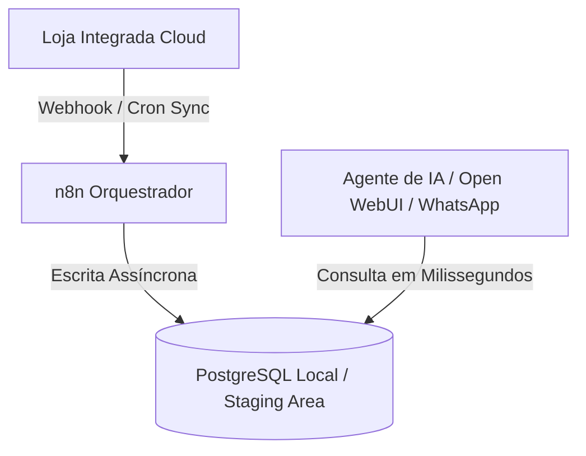

# Manual Técnico de Integração — Loja Integrada (API v1)

Este documento estabelece o **padrão técnico de integração** entre o ecossistema **daemind.** e a plataforma de e-commerce **Loja Integrada**. Ele serve como especificação arquitetural, guia de resiliência e referência operacional para desenvolvimento de conectores, automações no n8n e consumo via Inteligência Artificial.

---

## 1. Visão Geral da API & Arquitetura REST

A API da Loja Integrada é baseada no padrão **REST**, transmitindo payloads exclusivamente em **JSON** sobre o protocolo **HTTPS**.

- **URL Base de Produção:**
  ```http
  https://api.awsli.com.br/v1/
  ```
- **Escopo:** Gerenciamento de catálogo, alteração rápida de preços e estoque, leitura de pedidos, cadastro de envios/rastreamento e gestão de clientes.
- **Modelo de Comunicação:** A integração opera em modelo **passivo/pull/push**: o orquestrador local (**daemind.**) consome os endpoints REST para extrair dados ou injetar atualizações e escuta **Webhooks** em tempo real para eventos de entrada.

---

## 2. Autenticação Dual-Key & Cabeçalhos HTTP

A segurança no acesso exige um mecanismo de **autenticação obrigatório por chave dupla**:

| Credencial | Formato | Origem | Descrição |
| :--- | :--- | :--- | :--- |
| **Chave de API (`chave_api`)** | String alfanumérica de **20 caracteres** | Painel do Lojista (`Configurações > Chave para API`) | Identifica unicamente a loja do cliente. |
| **Chave de Aplicação (`aplicacao`)** | UUID padrão (`8-4-4-4-12`) | Formulário de Suporte ao Integrador | Identifica a aplicação/desenvolvedor parceiro. |

### 🔐 Método 1: Cabeçalho HTTP `Authorization` (Recomendado)
Ambas as chaves devem ser transmitidas concatenadas no cabeçalho `Authorization` da requisição HTTP:

```http
Authorization: chave_api {{CHAVE_API_LOJA}} aplicacao {{CHAVE_APLICACAO_UUID}}
```

**Exemplo cURL:**
```bash
curl --location 'https://api.awsli.com.br/v1/categoria/' \
  --header 'Content-Type: application/json' \
  --header 'Authorization: chave_api 10d674b6e5834dbc aplicacao ed102c0b-ff23-4826-b296-cfd2c913b133'
```

### 🔗 Método 2: Query String (Fallback)
```http
GET https://api.awsli.com.br/v1/categoria/?format=json&chave_api=10d674b6e5834dbc&chave_aplicacao=ed102c0b-ff23-4826-b296-cfd2c913b133
```

---

## 3. Resiliência, Rate Limiting & Deduplicação de Payloads

O tráfego de requisições enviado aos servidores da Loja Integrada é controlado por limiares estritos de proteção. Se qualquer limite for violado, a API retorna **HTTP 429 Too Many Requests**.

### 📊 Limites Globais de Débito:

| Nível de Controle | Limite Máximo | Código de Erro Interno | Causa do Estouro |
| :--- | :--- | :--- | :--- |
| **Por Loja (`chave_api`)** | **100 requisições / minuto** | `Err 633` | Requisições síncronas desordenadas geradas por robôs |
| **Por IP do Host** | **1.200 requisições / minuto** | `Err 133` | Múltiplas instâncias no mesmo IP estourando o limite da rede |
| **Por Aplicação (`aplicacao`)** | **3.000 requisições / minuto** | `Err 533` | Volume concorrente global de todas as lojas ativas da chave |

---

### 🛡️ Estratégia de Deduplicação SHA-256 (n8n Webhook Fallback)

Se a plataforma externa reenviar webhooks de retentativa alterando metadados de cabeçalho, a primeira etapa das esteiras do n8n executa uma função JavaScript (*Code Node*) para calcular o hash de deduplicação:

$$\text{dedup\_hash} = \text{SHA-256}(\text{payload\_body} + \text{LOJA\_APP\_KEY})$$

- O hash é gravado com **TTL de 5 minutos** no Redis/Postgres.
- Se o mesmo payload colidir dentro da janela de 5 minutos, o n8n responde **HTTP 200** imediatamente e encerra o fluxo, evitando duplicidade de gravações ou notificações repetidas no WhatsApp.

---

## 4. Padrão Staging Area Soberana (PostgreSQL)

Para **nunca estourar o limite de 100 req/min por loja** (evitando o Erro 633), o **daemind.** utiliza o padrão de **Staging Area Soberana**:



1. Os webhooks atualizam as tabelas locais `catalogo`, `produtos`, `pedidos` e `clientes` no PostgreSQL relacional.
2. O agente de Inteligência Artificial e a equipe de atendimento consultam **exclusivamente o banco local**, obtendo respostas em milissegundos sem realizar requisições HTTP para a Loja Integrada durante os atendimentos.

---

## 5. Mapeamento de Endpoints & Contrato OpenAPI 3.0.3

A especificação técnica **legível por máquina** encontra-se padronizada no repositório:
- 📄 **[openapi_loja_integrada.json](file:///e:/Documenta%C3%A7%C3%A3o/seu-repositorio-git/infra-loja1/docs/openapi_loja_integrada.json)**

### 📌 Resumo dos Principais Endpoints Mapeados:

| Recurso | Método | Rota | Descrição |
| :--- | :--- | :--- | :--- |
| **Categorias** | `GET` / `POST` | `/v1/categoria/` | Listagem e criação de categorias |
| **Categorias** | `GET` / `PUT` / `DELETE` | `/v1/categoria/{id}/` | Detalhes, atualização e exclusão |
| **Produtos** | `GET` / `POST` | `/v1/produto/` | Produtos normais, pai e filho |
| **Produtos** | `GET` / `PUT` / `DELETE` | `/v1/produto/{id}/` | Gestão de produtos individuais |
| **Estoque Rápido** | `GET` / `PUT` | `/v1/produto_estoque/{produto_id}/` | Atualização atômica de saldo |
| **Preço Rápido** | `GET` / `PUT` | `/v1/produto_preco/{produto_id}/` | Atualização atômica de preço |
| **Pedidos** | `GET` | `/v1/pedido/` | Listagem com filtro por situação |
| **Pedidos** | `GET` / `PUT` | `/v1/pedido/{pedido_id}/` | Consulta completa e alteração de status |
| **Envios** | `POST` | `/v1/pedido/envios/` | Injeção de código de rastreamento |
| **Clientes** | `GET` | `/v1/cliente/` | Listagem de compradores |
| **Webhooks** | `GET` / `POST` | `/v1/webhook/` | Cadastro de URLs receptoras |
| **Webhooks** | `DELETE` | `/v1/webhook/{webhook_id}/` | Remoção de assinatura de evento |

---

## 6. Configuração de Webhooks Inbound

Para escutar vendas e atualizações de produtos em tempo real, cadastre o webhook executando um `POST /v1/webhook/`:

```json
{
  "url": "https://sua-maquina.sua-tailnet.ts.net/webhook/loja",
  "acao": "pedido.criado"
}
```

### 📋 Principais Ações de Eventos Suportadas:
- `pedido.criado`: Disparado quando um novo pedido é efetuado na loja.
- `pedido.editado`: Disparado na alteração de status (ex: de pendente para pago/faturado).
- `produto.editado`: Disparado quando um preço ou saldo de estoque é alterado na plataforma.
