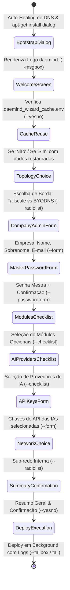

# Plano de Engenharia SRE: Frontend Dialog TUI para o Instalador daemind.

Este documento estabelece as especificações arquiteturais, máquina de estados, componentes visuais e guia de implementação da interface **TUI (Text User Interface)** baseada em **`dialog`** para o `preinstall.sh` e o `install.sh` do **daemind.**, preservando o desacoplamento modular, a compatibilidade com imagens mínimas do Ubuntu e o fail-safe não-interativo.

---

## 🎯 1. Objetivos e Requisitos Não-Funcionais

1. **Experiência Visual de Nível Industrial**: Substituir a sequência de perguntas de linha de comando por caixas de diálogo navegáveis com `Tab`, `Setas`, `Barra de Espaço` e `Enter`.
2. **Formulários Agrupados**: Eliminar a fadiga do operador permitindo preencher múltiplos dados (ex: Nome da Empresa, Nome, Sobrenome, E-mail) em uma única tela (`--form`).
3. **Seleção Polimórfica via Checklist**: Marcar/desmarcar módulos da stack (`--checklist`) de forma visual.
4. **Bootstrap Precoce em Imagens Mínimas**: Instalar o pacote `dialog` silenciosamente no segundo zero do script (antes de iniciar o Wizard interativo).
5. **Fail-Safe & Modo Headless (CI/CD)**: Se o terminal for não-interativo (`! [ -t 0 ]` ou `DEBIAN_FRONTEND=noninteractive`), o instalador deve alternar automaticamente para o modo clássico ou consumir o `.env` existente sem quebrar.
6. **Desacoplamento Preservado**: Os módulos em `core/scripts/install_*.sh` devem continuar sendo a fonte da verdade para suas opções no checklist.

---

## 🏗️ 2. Especificação da Máquina de Estados (Telas do Wizard)



---

## 📋 3. Mapeamento Detalhado de Telas e Componentes `dialog`

### 🖥️ Tela 0: Boas-vindas & Termos de Uso
- **Componente**: `dialog --title "daemind. - Sistema Operacional Autônomo" --msgbox`
- **Conteúdo**: Apresentação visual da solução, versão SRE e aviso de prontidão do servidor.

### 🔄 Tela 1: Reutilização de Sessão (Cache)
- **Componente**: `dialog --title "Reuso de Configurações" --yesno`
- **Conteúdo**: *"Detectamos respostas salvas de uma sessão anterior. Deseja reutilizá-las para acelerar o deploy?"*

### 🌐 Tela 2: Topologia de Borda & Roteamento
- **Componente**: `dialog --title "Topologia de Acesso Externo" --radiolist`
- **Itens**:
  1. `1 "Tailscale VPN Soberana" ON` (Acesso seguro via FQDN .ts.net com Let's Encrypt automático)
  2. `2 "Domínio Próprio (BYODNS)" OFF` (Configuração manual de DNS A/CNAME + Proxy Reverso)

### 🏢 Tela 3: Identidade Corporativa & Administrador
- **Componente**: `dialog --title "Identidade da Empresa e Administrador" --form`
- **Campos**:
  - `Nome da Empresa:` (ex: Minha Loja)
  - `Nome do Administrador:` (ex: Wellington)
  - `Sobrenome do Administrador:` (ex: Alcantara)
  - `E-mail Corporativo:` (ex: admin@minhaloja.com.br)

### 🔑 Tela 4: Credenciais Mestras de Segurança
- **Componente**: `dialog --title "Cofre Mestre de Senhas" --passwordform`
- **Campos**:
  - `Senha Mestra do Banco (DB/Redis/Stack):` (Mínimo 8 caracteres)
  - `Confirme a Senha Mestra:`

### 🧩 Tela 5: Seleção de Módulos Desacoplados (Stack Planner)
- **Componente**: `dialog --title "Seleção de Microsserviços Opcionais" --checklist`
- **Itens Dinâmicos** (Lidos dos metadados de `core/scripts/install_*.sh`):
  - `[X] n8n` — Motor de Automações Ilimitadas de Vendas e Webhooks
  - `[X] Chatwoot` — Inbox Omnichannel Multiatendente
  - `[X] Evolution` — API de Conexão com WhatsApp Webhook
  - `[X] Postiz` — Planejador e Publicador de Mídias Sociais + Temporal Engine
  - `[X] NocoDB` — CRM e Planilha Relacional Inteligente
  - `[X] S3MinIO` — Armazenamento de Arquivos S3 Soberano ou Cloud
  - `[X] OpenWebUI` — Interface Gráfica de IA Corporativa & MCP
  - `[X] Metabase` — Painéis e Dashboards de BI em Tempo Real
  - `[ ] Ollama` — Inferência Local de Modelos de Linguagem (Requer 16GB+ RAM)
  - `[ ] Docling` — OCR e Extração Avançada de Documentos

### 🤖 Tela 6: Seleção de Provedores de Inteligência Artificial
- **Componente**: `dialog --title "Roteamento de Inteligência Artificial (LiteLLM)" --checklist`
- **Itens**:
  - `[X] Google Gemini` — Modelos Gemini 2.0 Flash / Pro (Recomendado)
  - `[ ] OpenRouter` — Hub Multiprovedor Unificado
  - `[ ] OpenAI` — GPT-4o / GPT-4o-mini
  - `[ ] Anthropic` — Claude 3.5 Sonnet
  - `[ ] DeepSeek` — DeepSeek V3 / R1

### 🔐 Tela 7: Chaves de API das IAs Selecionadas
- **Componente**: `dialog --title "Chaves de Acesso de IA" --form`
- **Comportamento**: Renderiza exclusivamente as caixas de texto para as IAs marcadas na Tela 6.

### 🔌 Tela 8: Mapeamento de Sub-rede Privada
- **Componente**: `dialog --title "Rede Privada dos Contêineres (Bridge)" --radiolist`
- **Itens**:
  1. `1 "172.25.0.0/24 (Padrão Recomendado)" ON`
  2. `2 "10.50.0.0/24 (Corporativo Seguro)" OFF`
  3. `3 "192.168.200.0/24 (On-Premise)" OFF`
  4. `4 "Customizado (Digitar 3 primeiros octetos)" OFF`

### 📊 Tela 9: Resumo de Governança & Confirmação Final
- **Componente**: `dialog --title "Confirmação de Deploy da Stack" --yesno`
- **Conteúdo**: Tabela estruturada com todos os parâmetros coletados, módulos ativos e aviso de disparo em segundo plano.

---

## 🛠️ 4. Diretrizes Técnicas de Implementação

### 1. Manipulação Correta de File Descriptors no `curl | bash`
Quando o script é executado via pipe (`curl ... | bash`), o `stdin` padrão (fd 0) aponta para o stream do script, e não para o teclado. O `dialog` deve ser invocado redirecionando o terminal explicitamente:

```bash
exec 3>&1
RESPOSTA=$(dialog --title "Exemplo" --inputbox "Digite o valor:" 8 50 2>&1 1>&3 3>&-)
exec 3>&-
```
Ou utilizando `--stdout` conectado a `< /dev/tty`:
```bash
RESPOSTA=$(dialog --stdout --title "Exemplo" --inputbox "Digite o valor:" 8 50 < /dev/tty)
```

### 2. Estilização do Tema (`.dialogrc` Embutido)
Criar um arquivo temporário `/tmp/.dialogrc` com as cores do **daemind.** (Ciano `#00ffff`, Azul `#0055ff`, Amarelo e Fundo Dark) para que a TUI tenha um design moderno e elegante em conformidade com o terminal.

### 3. Integração Modular com a Arquitetura Desacoplada
No `preinstall.sh`, a lista do `--checklist` é construída dinamicamente:
```bash
CHECKLIST_ITEMS=()
for script in "$SCRIPTS_DIR"/install_*.sh; do
    [ ! -f "$script" ] && continue
    mod_name=$(basename "$script" .sh | sed 's/^install_//')
    [ "$mod_name" = "0ts" ] || [ "$mod_name" = "1ia" ] && continue
    
    mod_upper=$(echo "$mod_name" | tr '[:lower:]' '[:upper:]')
    use_val="${!USE_VAR:-s}"
    state="ON"
    [[ "$use_val" =~ ^[Nn]$ ]] && state="OFF"
    
    CHECKLIST_ITEMS+=("$mod_name" "Módulo $mod_upper" "$state")
done
```

---

## 📅 5. Roteiro de Execução em Fases

- [ ] **Fase 1: Preparação & Bootstrap** — Injeção do `apt-get install -y dialog` precoce e detecção de TTY no `preinstall.sh`.
- [ ] **Fase 2: Motor Wrapper TUI** — Criação de funções utilitárias universais (`tui_form`, `tui_checklist`, `tui_radiolist`, `tui_msgbox`, `tui_password`).
- [ ] **Fase 3: Refatoração do Wizard** — Substituição sequencial das coletas de texto pelas telas do Dialog com suporte a persistência no `.daemind_wizard_cache.env`.
- [ ] **Fase 4: Validação & Fallback** — Teste em ambiente real Ubuntu Server Minimal e validação de fallback headless.
